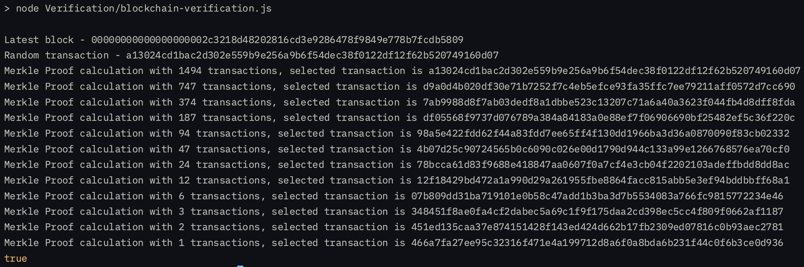

## Blockchain verification using Merkle proof in JavaScript

Example code taken from [This repo](https://gist.github.com/eddmann/6b8d0ddd3123c37f296b7680b8fa198a)

To run the verification script

```shell
npm i
npm run verify
```

---

What happens in a proof calculation?
- Fetching the latest block hash from blockchain
- Getting information of the block and picking up two specific data points - merkle root and transaction hashes
- Selecting a random transaction hash from the list (leaf)
- Calculating the merkle proof using the transaction and the whole list of transactions
- Verifying the merkle proof stands for the proof generated in previous step

---

Steps involved in BTC merkle root calculation:
- List All Transactions:
  - Start with all the transactions in the block. Each transaction is hashed using SHA-256 twice (double SHA-256) to produce a transaction hash.
- Pair Hashes Together:
  - The transaction hashes are paired together. If the number of transactions is odd, the last hash is duplicated to make the number of pairs even.
- Hash the Pairs:
  - Each pair of hashes is concatenated together and hashed again using double SHA-256. This produces a new list of hashes, which are now half the size of the previous list.
- Repeat the Process:
  - The process of pairing and hashing is repeated on the new list of hashes until only one hash remains. This final hash is the Merkle root.

---

Merkel proof calculation complexity ( log<sub>2</sub>1494 steps)
-------

